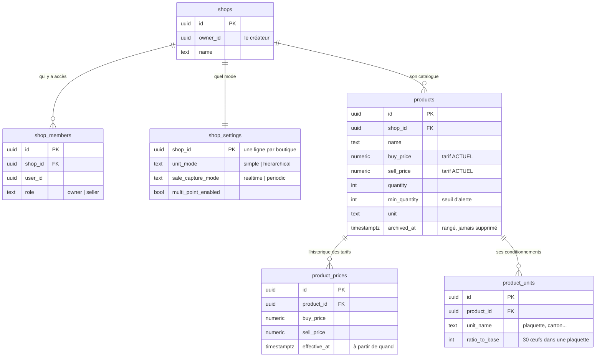
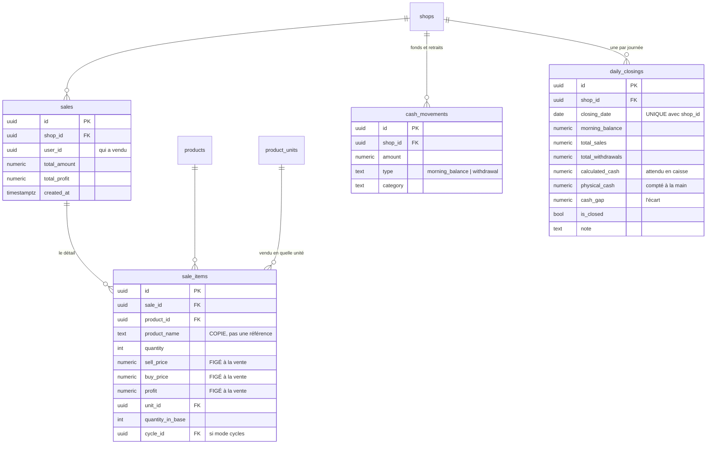
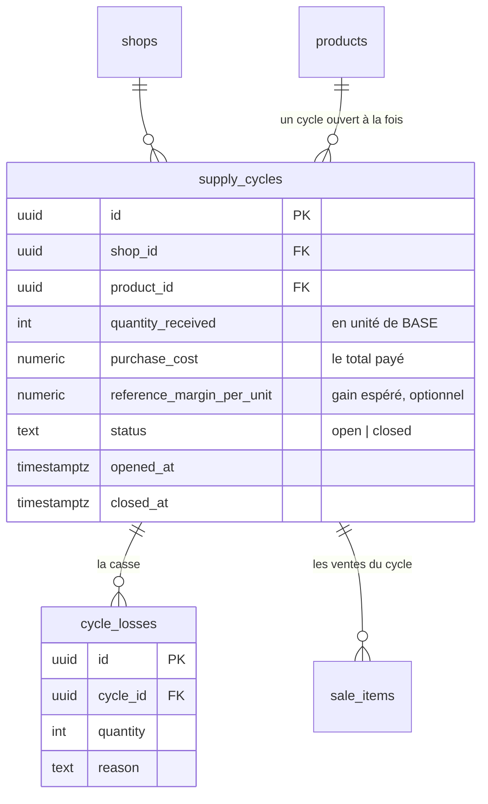
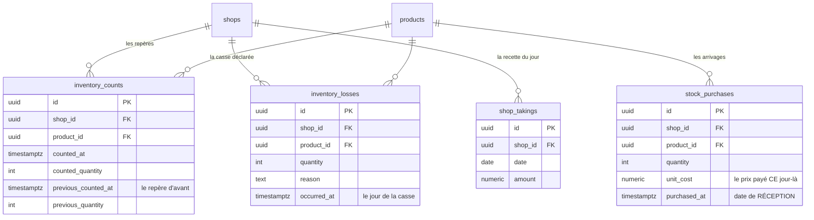
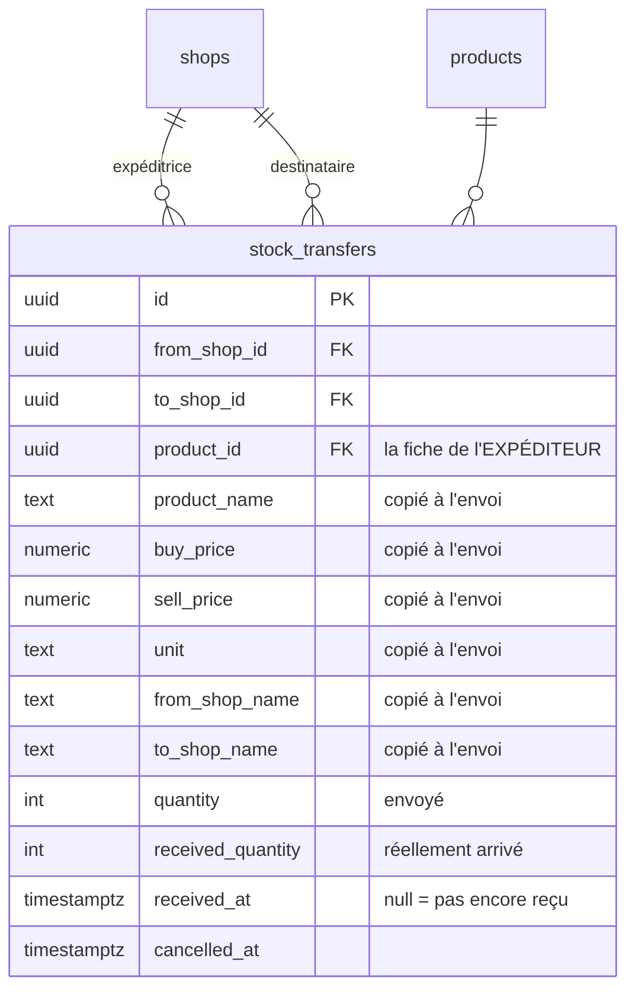
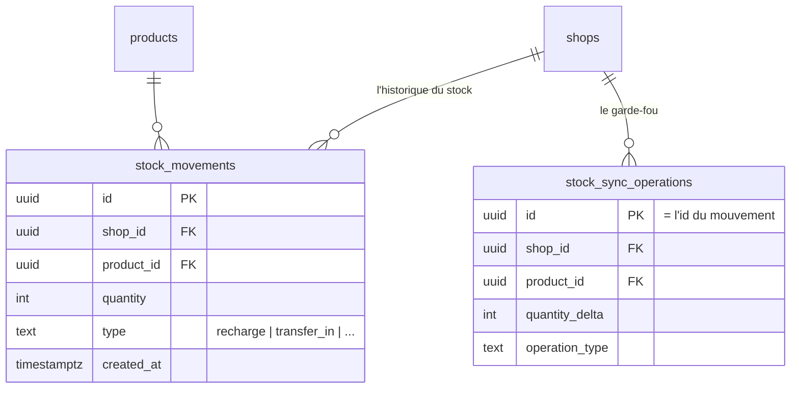

# Le schéma de la base ShopTrack

Dix-neuf tables, relevées sur Supabase le 21/08/2026. La base locale (Drift)
porte les mêmes tables avec les mêmes colonnes, préfixées `Local` — c'est
volontaire : une donnée doit pouvoir descendre et remonter sans traduction.

Un seul diagramme de dix-neuf tables serait illisible. Elles sont donc
regroupées par domaine, dans l'ordre où on les rencontre en lisant le code.

---

## 1. Le noyau — ce qui existe dans les trois modes



**`shop_settings` décide de tout.** Deux interrupteurs, quatre combinaisons —
mais seules trois sont utilisées : vente simple, cycles (`hierarchical`),
inventaire (`periodic`). C'est cette ligne que lit `_HomeForShopMode` pour
choisir quel accueil construire.

**`products.buy_price` et `sell_price` sont les tarifs du jour**, pas ceux du
passé. Le passé vit dans `product_prices`, avec sa date d'entrée en vigueur.
Sans cette table, changer un prix réécrirait tous les bilans déjà consultés.

**`archived_at` remplace la suppression.** Un produit qui a servi ne se supprime
pas : les rapports de périodes closes le citent encore. On l'archive, il
disparaît du stock, du comptage et de la vente — son histoire reste.

---

## 2. Vente simple — la vente est enregistrée à l'instant



**`sale_items` copie tout au lieu de référencer.** Le nom, les deux prix et le
bénéfice sont écrits au moment de la vente. Changer le tarif demain ne touche
donc aucune vente d'hier — c'est un fait daté, pas une vue sur la fiche.

**`daily_closings` est unique par `(shop_id, closing_date)`.** Une journée ne se
clôture qu'une fois ; refermer après réouverture met à jour la même ligne et
conserve la note précédente.

**`calculated_cash` = fonds du matin + ventes − retraits.** L'écart avec
`physical_cash` est le chiffre que le patron regarde en premier.

---

## 3. Cycles — le bilan par arrivage



**Le coût unitaire n'est pas stocké : il se recalcule.** `purchase_cost ÷
quantity_received`. Tes 135 000 F pour 900 œufs donnent 150 F, et ce 150 ne
dépend d'aucun tarif de fiche. Modifier le prix d'achat du produit ne touche
donc aucun cycle passé.

**`reference_margin_per_unit` fabrique le prix de vente.** Gain espéré déclaré
à l'arrivage → l'app propose `(coût + gain) ÷ quantité × contenance`. C'est
l'inverse de la démarche habituelle, et c'est celle du commerçant : « j'ai payé
135 000, je veux gagner 45 000 dessus ».

**Un seul cycle ouvert par produit.** Un deuxième arrivage par-dessus le
premier rendrait invendable le reliquat du précédent — l'app le refuse.

---

## 4. Inventaire — les ventes se déduisent, elles ne se saisissent pas



**Chaque comptage porte le précédent.** `previous_counted_at` et
`previous_quantity` sont écrits en dur dans la ligne : une période se lit sans
requête sur les autres lignes. C'est ce qui rend le rapport rapide — et c'est
aussi pourquoi on ne peut pas insérer un comptage antérieur après coup.

**Le calcul central :**

```
sorties  = stock d'ouverture + arrivages + transferts reçus
           − transferts envoyés − stock compté
vendus   = sorties − pertes déclarées
```

**`stock_purchases.purchased_at` est la date de réception**, pas celle de la
saisie. Une livraison du lundi notée le mercredi appartient à la période du
lundi. Le rapport lit cette table et non `stock_movements`, dont la date est
celle de l'envoi au serveur.

**Le prix de vente d'une période est pondéré par les jours.** L'app parcourt
chaque jour de la période et retient le tarif en vigueur ce jour-là, d'après
`product_prices`. Un tarif changé après la clôture porte une date postérieure :
il n'est jamais retenu, la période close ne bouge pas.

---

## 5. Transferts entre boutiques



**Tout est copié dans la ligne de transfert.** Le nom, les prix, l'unité, les
deux noms de boutique. Ce n'est pas de la redondance paresseuse : le
destinataire n'a **jamais téléchargé** la fiche produit de l'expéditeur — le
pull filtre par boutique active. Sans ces copies, une réception depuis une
boutique jamais ouverte sur l'appareil échouait en silence.

**`received_at` sert de garde.** Confirmer deux fois créditait le stock deux
fois : six bidons envoyés, douze sur l'étagère, et rien dans la table pour le
trahir. Une réception déjà datée est désormais refusée.

**Les noms de boutique sont figés à l'envoi**, volontairement : un reçu ne se
réécrit pas parce que l'enseigne a changé.

---

## 6. Synchronisation



**`stock_sync_operations` empêche d'appliquer deux fois le même mouvement.** La
fonction serveur `apply_stock_movement` y insère l'opération avec son
identifiant ; si la ligne existe déjà, elle rend le stock courant sans rien
retoucher. Un réseau qui coupe au retour peut donc renvoyer l'opération sans
danger.

**La file d'attente n'existe qu'en local** (`sync_queue`, table Drift). Elle ne
monte jamais sur le serveur : c'est la liste de ce qui n'est pas encore parti.

---

## Les trois règles à ne jamais oublier

**Toute table synchronisée se déclare dans `tablesTirees`**
(`lib/core/sync/pull_registry.dart`). Une colonne oubliée là et le
téléchargement réécrit la ligne locale sans elle — la donnée disparaît
quelques secondes après sa création, invisible sur un seul téléphone.

**Toute lecture locale filtre par `shop_id`.** Le pull fusionne sans jamais
vider : la base locale garde les données de chaque boutique visitée. Sans
filtre, deux boutiques se mélangent — et une écriture peut partir avec
l'identité d'une autre.

**Toute date envoyée au serveur passe par `.toUtc()`.** Une heure locale sans
fuseau est rangée comme universelle, et une vente de 23 h se retrouve au
lendemain, donc dans la mauvaise clôture.
